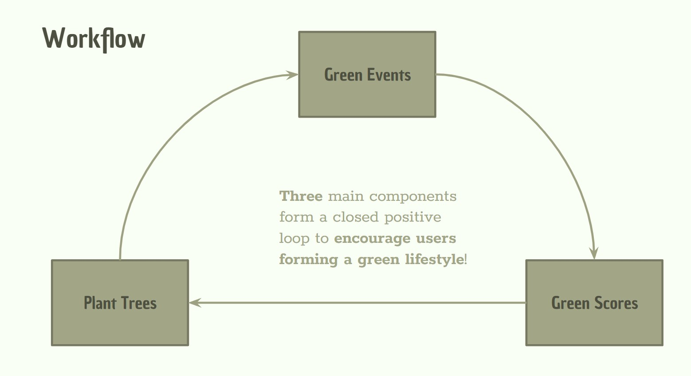
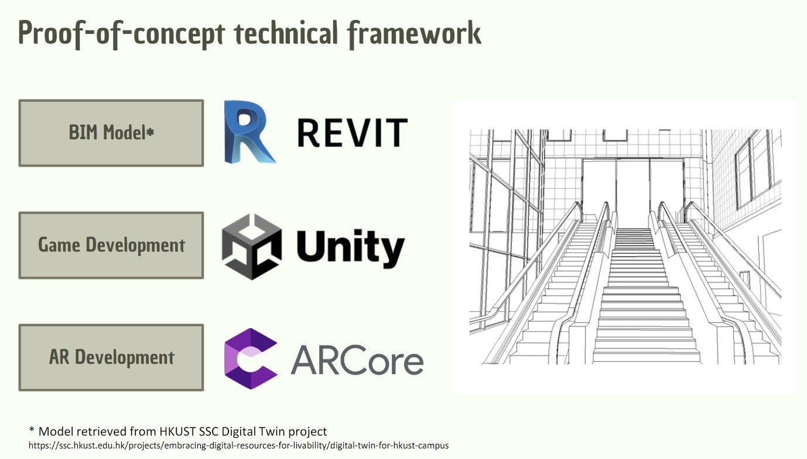

# USTreePlantAR - VISPIE

This is the repo of group VISPIE for HackUST 2022.

## What does this AR app do?

## Implementation

## Extra Unity Package Used (Please also import these packages to the Unity)
1. [Lowpoly Environment - Nature Pack Free](https://assetstore.unity.com/packages/3d/environments/lowpoly-environment-nature-pack-free-187052)
2. [Unity Terrain - URP Demo Scene](https://assetstore.unity.com/packages/3d/environments/unity-terrain-urp-demo-scene-213197)

## How to run?

1. Open this project using Unity
2. Sign the application in Unity using Keystore Manager
3. Setup Google Cloud Anchor API according to <https://developers.google.com/ar/develop/unity-arf/cloud-anchors/developer-guide-android>
4. Open `Nav.unity` in `Assets/Scenes` and build the application for Android in Unity

### NOTE

1. The model is not included in this repo. Acknowledge the [HKUST Digital Twin SSC project](https://ssc.hkust.edu.hk/projects/embracing-digital-resources-for-livability/digital-twin-for-hkust-campus) for providing the HKUST 3D model.
2. We have only tested in an Andorid phone (i.e., Google Pixel 6). It might not work for iOS or other Android model.
3. This application is just a proof-of-concept demos and is not used for production.
